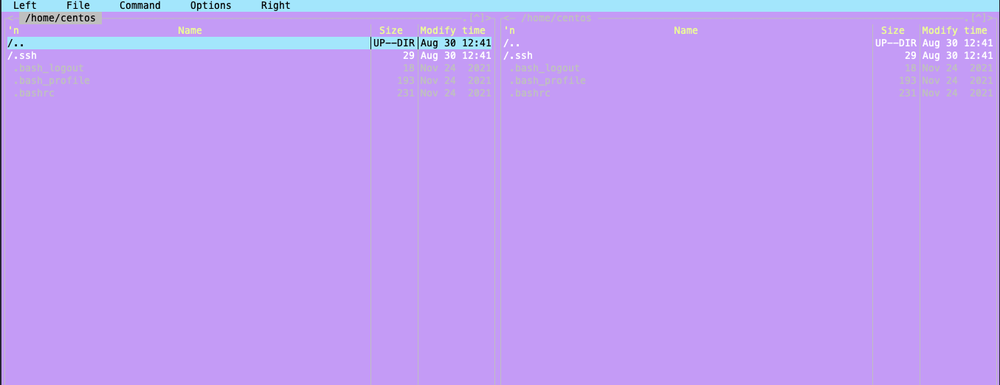

# Урок 1. Введение в Linux. Философия, базовые понятия, установка дистрибутива

### 1. 
Вместо установки виртуальной машины, предоставляю [terraform manifest](../terraform)

### 2. 
```bash
ssh centos@51.250.1.158
-bash: warning: setlocale: LC_CTYPE: cannot change locale (UTF-8): No such file or directory
[centos@fhmhu3gavimkihoegdh2 ~]$ ping 8.8.8.8
PING 8.8.8.8 (8.8.8.8) 56(84) bytes of data.
64 bytes from 8.8.8.8: icmp_seq=1 ttl=61 time=16.7 ms
64 bytes from 8.8.8.8: icmp_seq=2 ttl=61 time=16.5 ms
64 bytes from 8.8.8.8: icmp_seq=3 ttl=61 time=16.4 ms
^C
--- 8.8.8.8 ping statistics ---
3 packets transmitted, 3 received, 0% packet loss, time 2003ms
rtt min/avg/max/mdev = 16.414/16.557/16.758/0.180 ms
```
### 3. 
```bash
[root@fhmkq721al0lgjkh7lgh centos]# yum install mc -y
...
Installed:
  mc.x86_64 1:4.8.7-11.el7
...
Complete!
```
