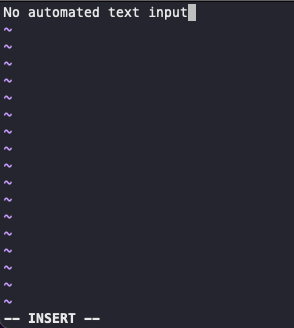

# Урок 3. vim/cat/grep и прочие утилиты для жизни в Linux и работы с текстовыми файлами

### 1.
```bash
[centos@fhmkq721al0lgjkh7lgh ~]$ vim -c ':r! ping 8.8.8.8 -c 1' -c ':wq!' test_file
[centos@fhmkq721al0lgjkh7lgh ~]$ cat test_file
PING 8.8.8.8 (8.8.8.8) 56(84) bytes of data.
64 bytes from 8.8.8.8: icmp_seq=1 ttl=61 time=16.2 ms

--- 8.8.8.8 ping statistics ---
1 packets transmitted, 1 received, 0% packet loss, time 0ms
rtt min/avg/max/mdev = 16.287/16.287/16.287/0.000 ms
```

```bash
[centos@fhmkq721al0lgjkh7lgh ~]$ cat test_file2
No automated text input
```

### 2.
```bash
[centos@fhmkq721al0lgjkh7lgh ~]$ cat errors | wc -l
98
```

### 3.
```bash
[centos@fhmkq721al0lgjkh7lgh ~]$ ls -la | tail -n +2 | cut -d " " -f 1 | sort | uniq | wc -l
5
[centos@fhmkq721al0lgjkh7lgh ~]$ ls -la | tail -n +2 | cut -d " " -f 1 | wc -l
13
[centos@fhmkq721al0lgjkh7lgh ~]$ ls -la | cut -d " " -f 1 | wc -l
14
```

### 4.
```bash
[centos@fhmkq721al0lgjkh7lgh ~]$ find `pwd` -iname '.*' -type f | wc -l
7
```

### 5.
```bash
[centos@fhmkq721al0lgjkh7lgh ~]$ grep -P "\b(?:(?:25[0-5]|2[0-4][0-9]|[01]?[0-9][0-9]?)\.){3}(?:25[0-5]|2[0-4][0-9]|[01]?[0-9][0-9]?)\b" log
Aug 28 00:10:57 v1160401 sshd[159045]: Disconnected from invalid user ftpuser1 159.223.89.31 port 50134 [preauth]
Aug 28 00:11:14 v1160401 sshd[159047]: Invalid user admin from 197.5.145.190 port 45667
Aug 28 00:11:14 v1160401 sshd[159047]: Received disconnect from 197.5.145.190 port 45667:11: Bye Bye [preauth]
Aug 28 00:11:14 v1160401 sshd[159047]: Disconnected from invalid user admin 197.5.145.190 port 45667 [preauth]
Aug 28 00:11:33 v1160401 sshd[159049]: Invalid user oracle from 102.133.162.46 port 33424
Aug 28 00:10:57 v1160401 sshd[159045]: Disconnected from invalid user ftpuser1 159.223.89.31 port 50134 [preauth]
Aug 28 00:11:14 v1160401 sshd[159047]: Invalid user admin from 197.5.145.190 port 45667
Aug 28 00:11:14 v1160401 sshd[159047]: Received disconnect from 197.5.145.190 port 45667:11: Bye Bye [preauth]
Aug 28 00:11:14 v1160401 sshd[159047]: Disconnected from invalid user admin 197.5.145.190 port 45667 [preauth]
Aug 28 00:11:33 v1160401 sshd[159049]: Invalid user oracle from 102.133.162.46 port 33424
Aug 28 00:10:57 v1160401 sshd[159045]: Disconnected from invalid user ftpuser1 159.223.89.31 port 50134 [preauth]
Aug 28 00:11:14 v1160401 sshd[159047]: Invalid user admin from 197.5.145.190 port 45667
Aug 28 00:11:14 v1160401 sshd[159047]: Received disconnect from 197.5.145.190 port 45667:11: Bye Bye [preauth]
Aug 28 00:11:14 v1160401 sshd[159047]: Disconnected from invalid user admin 197.5.145.190 port 45667 [preauth]
Aug 28 00:11:33 v1160401 sshd[159049]: Invalid user oracle from 102.133.162.46 port 33424

[centos@fhmkq721al0lgjkh7lgh ~]$ grep -Po "\b(?:(?:25[0-5]|2[0-4][0-9]|[01]?[0-9][0-9]?)\.){3}(?:25[0-5]|2[0-4][0-9]|[01]?[0-9][0-9]?)\b" log
159.223.89.31
197.5.145.190
197.5.145.190
197.5.145.190
102.133.162.46
159.223.89.31
197.5.145.190
197.5.145.190
197.5.145.190
102.133.162.46
159.223.89.31
197.5.145.190
197.5.145.190
197.5.145.190
102.133.162.46
```