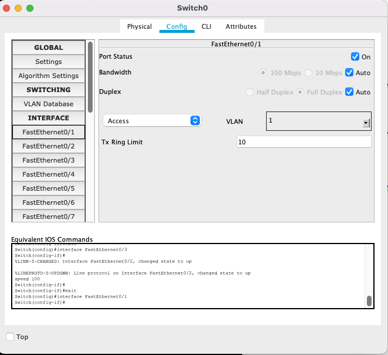
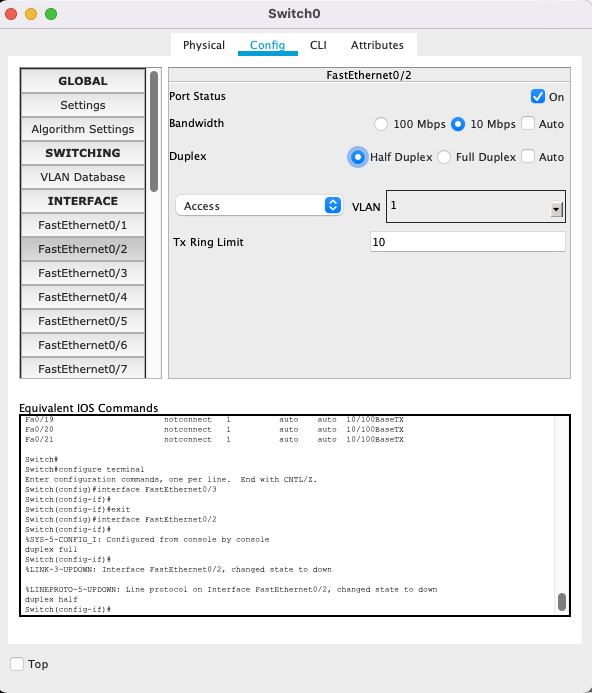
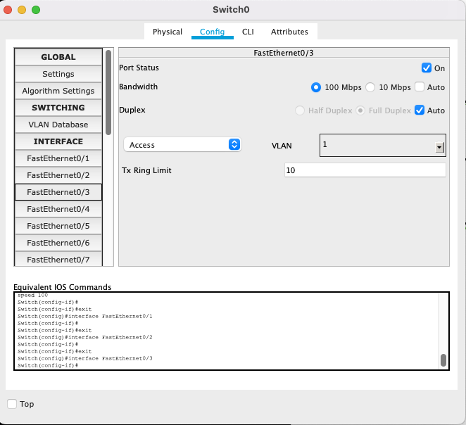

# Урок 2. Первый уровень модели TCP/IP: Физический уровень
>>> Конфигурация инетрфейсов switch




```bash
Switch#show interface status
Port      Name               Status       Vlan       Duplex  Speed Type
Fa0/1                        connected    1          auto    auto  10/100BaseTX
Fa0/2                        connected    1          a-half  a-10  10/100BaseTX
Fa0/3                        connected    1          auto    a-100 10/100BaseTX
Fa0/4                        notconnect   1          auto    auto  10/100BaseTX
...
```
