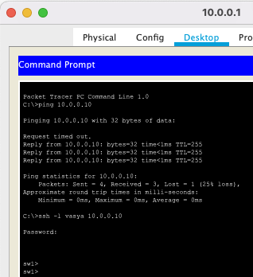

# Урок 4. Второй уровень модели TCP/IP. Изучение cli, настройка коммутаторов

```bash
sw1(config)#username vasya secret 5  vasyapassword123
sw2(config)#username vasya secret 5 vasyapassword123
```

```bash
sw1(config)#line vty 0 15
sw1(config-line)#transport in ssh
sw1(config)#ip access-list standard VTY_ACCESS
sw1(config-std-nacl)#permit host 10.0.0.1
sw1(config-std-nacl)#deny any
sw1(config)#line vty 0 15
sw1(config-line)#access-class VTY_ACCESS in 
sw1(config-line)#do show ru
...
ip access-list standard VTY_ACCESS
 permit host 10.0.0.1
 deny any
line con 0
!
line vty 0 4
 access-class VTY_ACCESS in
 login
 transport input ssh
line vty 5 15
 access-class VTY_ACCESS in
 login
 transport input ssh
 ...
sw1(config)#interface Vlan 1 
sw1(config-if)#ip address 10.0.0.10 255.255.255.0
sw1(config-if)#no shutdown 

sw1(config-if)#
%LINK-5-CHANGED: Interface Vlan1, changed state to up

%LINEPROTO-5-UPDOWN: Line protocol on Interface Vlan1, changed state to up
sw1(config)#ip domain-name lesson-2.4-sw1.gb.ru
sw1(config)#crypto key generate rsa 
The name for the keys will be: sw1.lesson-2.4-sw1.gb.ru
Choose the size of the key modulus in the range of 360 to 2048 for your
  General Purpose Keys. Choosing a key modulus greater than 512 may take
  a few minutes.

How many bits in the modulus [512]: 2048
% Generating 2048 bit RSA keys, keys will be non-exportable...[OK]
```
```bash
sw2(config)#line vty 0 15
sw2(config-line)#transport input ssh
sw2(config)#ip access-list standard VTY_ACCESS
sw2(config-std-nacl)#permit host 10.0.0.4
sw2(config-std-nacl)#deny any
sw2(config)#line vty 0 15
sw2(config-line)#access-class VTY_ACCESS in 
sw2(config-line)#do show ru
...
access-list 1 permit host 10.0.0.4
ip access-list standard VTY_ACCESS
 permit host 10.0.0.4
 deny any
line con 0
!
line vty 0 4
 access-class VTY_ACCESS in
 login
 transport input ssh
line vty 5 15
 access-class VTY_ACCESS in
 login
 transport input ssh
...
sw2(config)#interface Vlan 1 
sw2(config-if)#ip address 10.0.0.11 255.255.255.0
sw2(config-if)#no shutdown
%LINK-5-CHANGED: Interface Vlan1, changed state to up

%LINEPROTO-5-UPDOWN: Line protocol on Interface Vlan1, changed state to up
sw2(config)#ip domain-name lesso-2.4.gb.ru
sw2(config)#crypto key generate rsa 
The name for the keys will be: sw2.lesso-2.4.gb.ru
Choose the size of the key modulus in the range of 360 to 2048 for your
  General Purpose Keys. Choosing a key modulus greater than 512 may take
  a few minutes.

How many bits in the modulus [512]: 2048
% Generating 2048 bit RSA keys, keys will be non-exportable...[OK]
```
> SSH connection to sw1


> SSH connection to sw2

