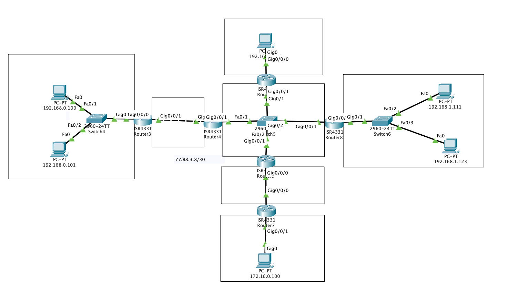
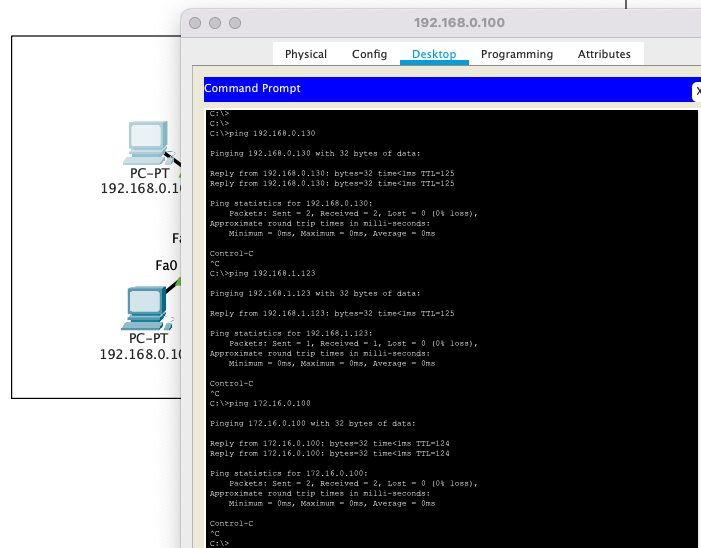
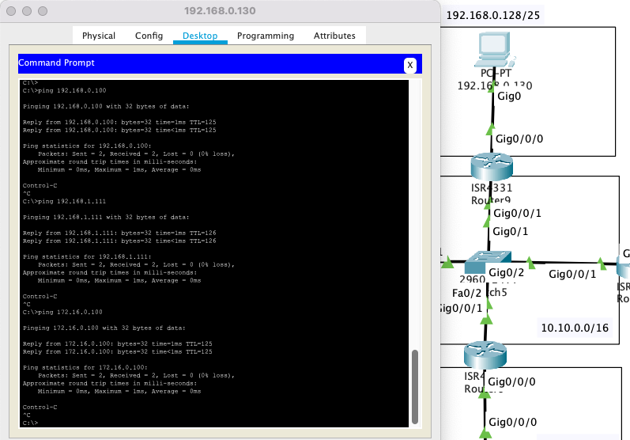
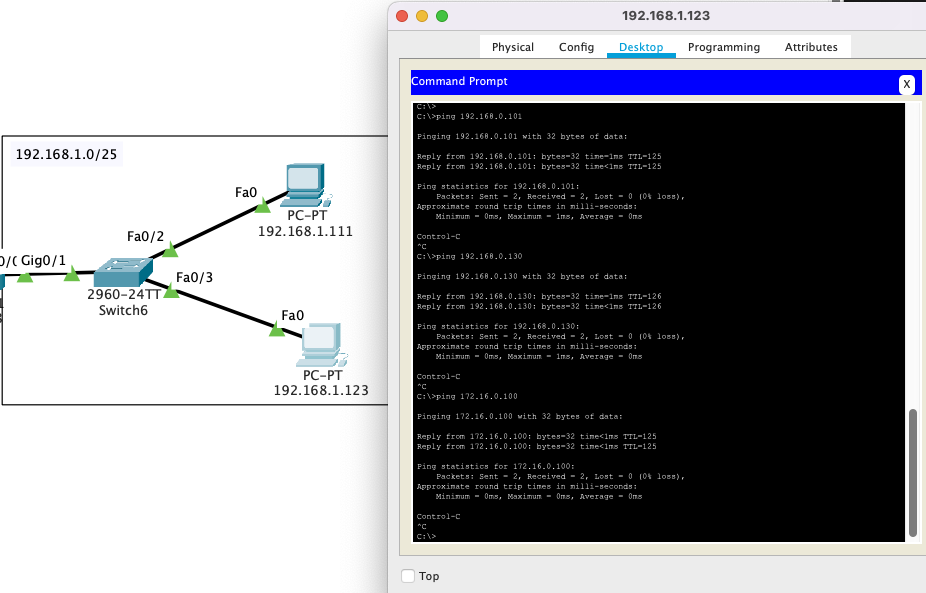
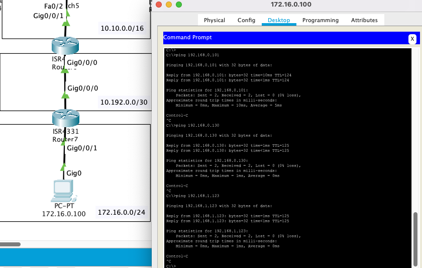
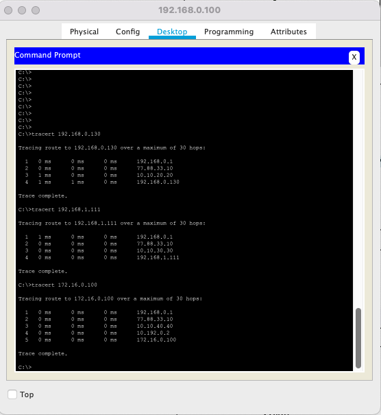
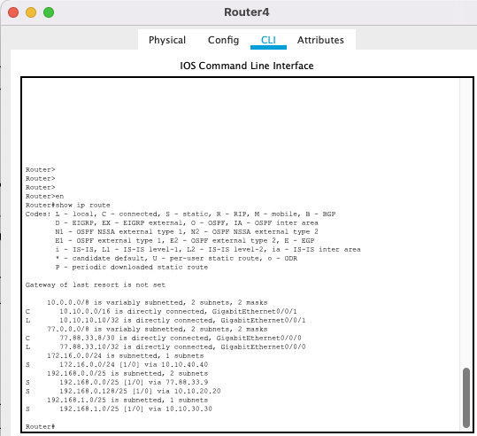

# Урок 6. Третий уровень модели TCP/IP. Бесклассовая маршрутизация

#### 1.

#### 2. 




### 3.


#### *.
```bash 
Router(config)#ip route 192.168.0.0 255.255.254.0 10.192.0.1
Router(config)#do show ip route 
Codes: L - local, C - connected, S - static, R - RIP, M - mobile, B - BGP
       D - EIGRP, EX - EIGRP external, O - OSPF, IA - OSPF inter area
       N1 - OSPF NSSA external type 1, N2 - OSPF NSSA external type 2
       E1 - OSPF external type 1, E2 - OSPF external type 2, E - EGP
       i - IS-IS, L1 - IS-IS level-1, L2 - IS-IS level-2, ia - IS-IS inter area
       * - candidate default, U - per-user static route, o - ODR
       P - periodic downloaded static route

Gateway of last resort is not set

     10.0.0.0/8 is variably subnetted, 2 subnets, 2 masks
C       10.192.0.0/30 is directly connected, GigabitEthernet0/0/0
L       10.192.0.2/32 is directly connected, GigabitEthernet0/0/0
     172.16.0.0/16 is variably subnetted, 2 subnets, 2 masks
C       172.16.0.0/24 is directly connected, GigabitEthernet0/0/1
L       172.16.0.1/32 is directly connected, GigabitEthernet0/0/1
S    192.168.0.0/23 [1/0] via 10.192.0.1
```